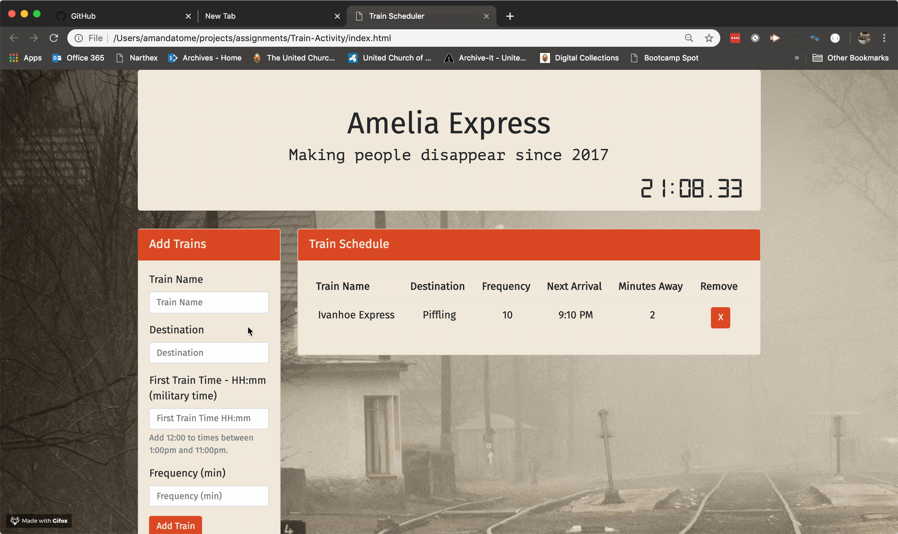

# Train-Activity
Train Scheduling activity using Firebase and Moment.js.

## Site
https://amandat85.github.io/Train-Activity/

## Languages and Tools Used
* HTML
* Bootstrap
* Javascript
* jQuery
* CSS
* Custom Fonts
* Google Fonts
* Firebase
* Moment.js

## How it works
* Enter information into the "Add Trains" form.
* When you click the add trains button, the new train information will display in the train table.
* Train times will update every minute
* Remove a train by clicking on the "X" at the end of the row.

## Animated Gif

